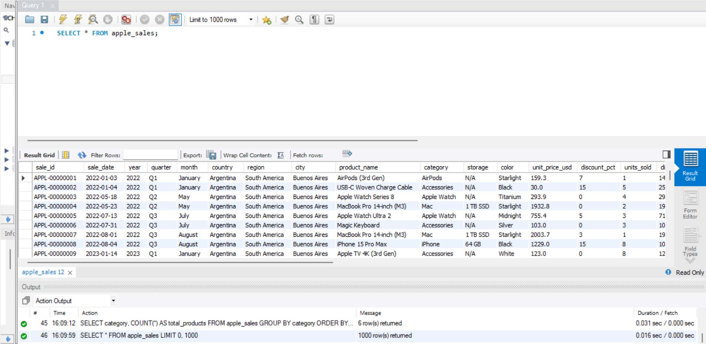
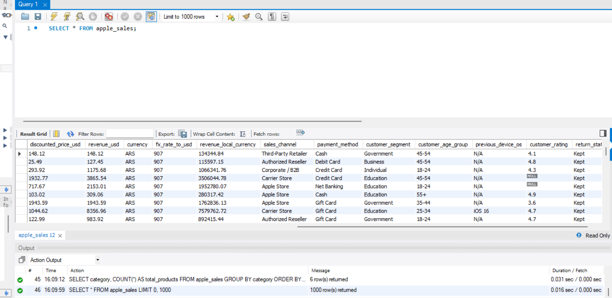
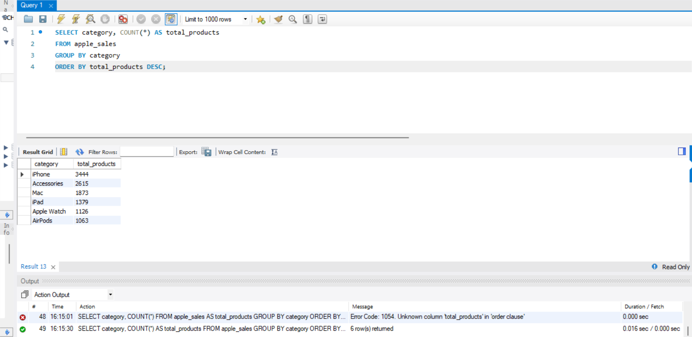
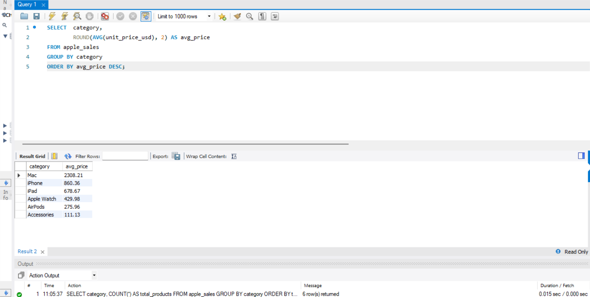
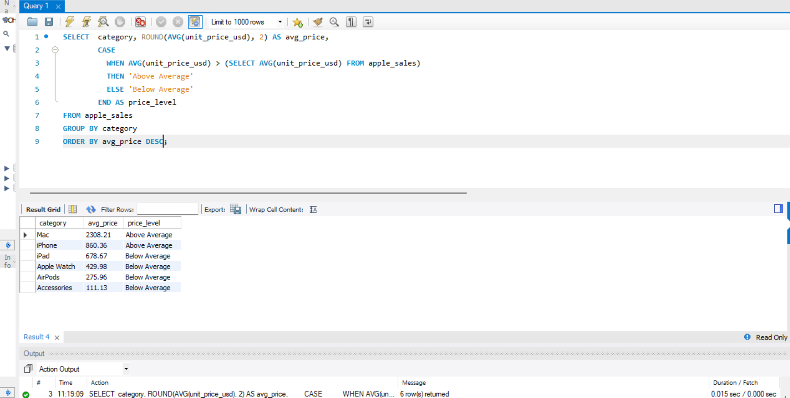
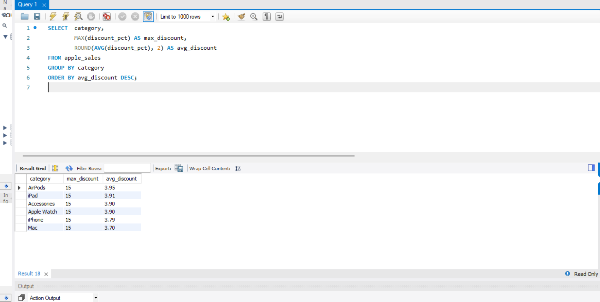

# Apple Product Sales Analysis
A SQL portfolio project exploring Apple product sales data. I dug into product performance, customer ratings, and return trends using MySQL covering everything from basic aggregations to window functions and CTEs. Built this to sharpen my SQL skills and show how data can tell a story about real-world business decisions.

# Executive Summary
This analysis examines Apple's product sales performance across categories, storage variants, colour preferences, pricing, and return behaviour. The goal is to surface patterns that can inform product strategy, inventory planning and customer experience decisions. Findings sare drawn directly from transactional sales data and presented with supporting SQL queries for full transparency and reproducibility.

# The Dataset



# Analysis

## 1. How broad is each product category?
**Business question**: How many products does Apple carry in each category?

```
SELECT category, COUNT(*) AS total_products
FROM apple_sales
GROUP BY category
ORDER BY total_products DESC;
```


**Finding**: Reveals which categories have the widest product range. A category with many products signals a broad target audience, while a small count suggest a more focused or premium segment. From here we could identify that iPhone has the highest product range.

## 2. Which category commands the highest average price?
**Business question**: What is the average unit price per category, and how do they rank against each other?

```
SELECT category, ROUND(AVG(unit_price_usd), 2) AS avg_price
FROM apple_sales
GROUP BY category
ORDER BY avg_price DESC;
```


**Finding**: This highlights which categories sit at the premium end of Apple's products. This is useful context for pricing strategy and understanding how each category is positioned in the market. The highest average price is Mac. Even though it is not the widest product range, it generates the most revenue among the lineup. This suggests that Mac is the most premium product.

## 3. Is each category priced above or below the company average?
**Business question**: How does each category's average price compare to Apple's overall average selling price?

```
SELECT  category, ROUND(AVG(unit_price_usd), 2) AS avg_price,
        CASE
          WHEN AVG(unit_price_usd) > (SELECT AVG(unit_price_usd) FROM apple_sales)
          THEN 'Above Average'
          ELSE 'Below Average'
        END AS price_level
FROM apple_sales
GROUP BY category
ORDER BY price_level;
```


**Finding**: Quickly segments the portfolio into premium and accessible tiers relative to the company's overall average price. Categories sitting below average may benefit from upselling strategies or product repositioning.

## 4. Where are the deepest discounts being applied?
**Business question**: Which products are being discounted most aggresively?

```
SELECT  category, MAX(discount_pct) AS max_discount
        ROUND(AVG(discount_pct), 2) AS avg_discount
FROM apple_sales
GROUP BY category
ORDER BY avg_discount DESC;
```


**Finding**: Product with consistently high discounts may indicate slow-moving inventory, end-of-cycle models, or agreesive promotional activity. This signals where pricing intervention or product refresh may be needed. Accoding to the screesnhot, maximum discount rate is 15% and average is less than 4%. This suggests that Apple maintains a disciplined pricing strategy with no significant promotional discounting in any single category.

## 5. Which storage variant for each category sells the most units?
**Business question**: Which storage configurations are customers choosing the most for each category, and what percentage of total sales does each represent?


