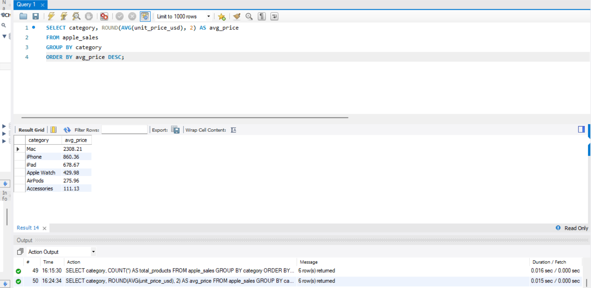

# Apple Product Sales Analysis
A SQL portfolio project exploring Apple product sales data. I dug into product performance, customer ratings, and return trends using MySQL covering everything from basic aggregations to window functions and CTEs. Built this to sharpen my SQL skills and show how data can tell a story about real-world business decisions.

# Executive Summary
This analysis examines Apple's product sales performance across categories, storage variants, colour preferences, pricing, and return behaviour. The goal is to surface patterns that can inform product strategy, inventory planning and customer experience decisions. Findings sare drawn directly from transactional sales data and presented with supporting SQL queries for full transparency and reproducibility.

# The Dataset


# Analysis

## 1. How broad is each product category?
**Business question**: How many products does Apple carry in each category?

```
SELECT category, COUNT(*) AS total_products
FROM apple_sales
GROUP BY category
ORDER BY total_products DESC;
```


2. 
```
SELECT category, ROUND(AVG(unit_price_usd), 2) AS avg_price
FROM apple_sales
GROUP BY category
ORDER BY avg_price DESC;
```


**Finding**: This gives a clear picture of how broad each category is in terms of sales count, and which sits at the premium end of Apple's pricing tier. Categories with fewer products but higher average prices signal premium, focused segments.

Most demanded product: iPhone

Most premium product: Mac

## 2. Discount Exposure by Category
**Business question**: Which product categories are being discounted most aggressively, and is that above the company's overall average?

```
SELECT category, ROUND(AVG(unit_price_usd), 2) AS avg_price
  CASE
    WHEN AVG(unit_price_usd) > (SELECT AVG(unit_price_usd) FROM apple_sales)
    THEN 'Above Average'
    ELSE 'Below Average'
  END AS price_level
FROM apple_sales
GROUP BY category
ORDER BY price_level;
```
